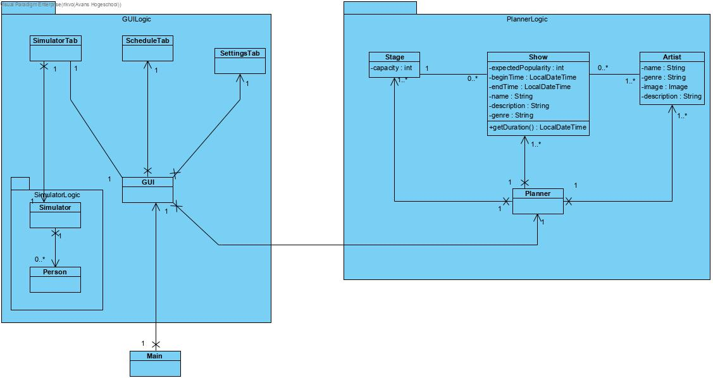
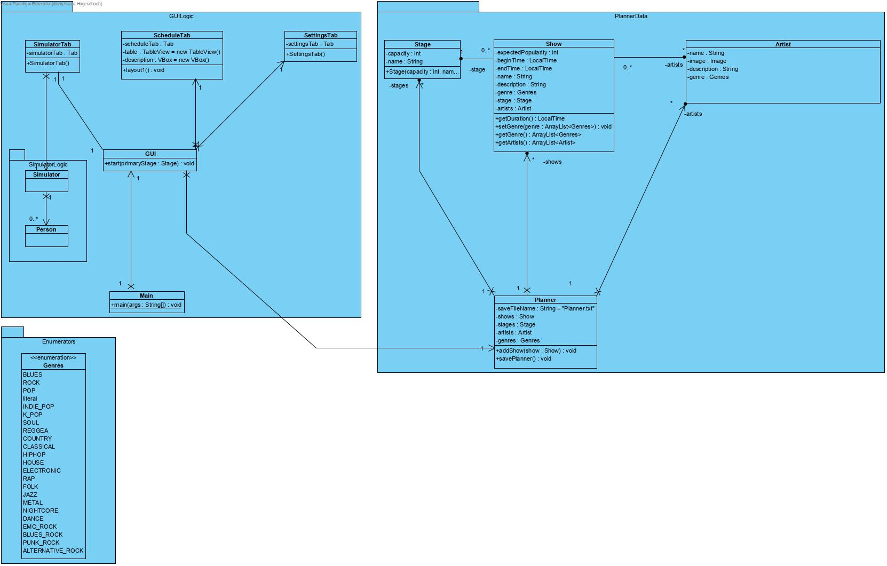

# Portfolio
## reflection

###week 2
####samenwerking
we hebben wat problemen ervaren met git, we hebben een code beheerder die nog niet ervaren was met github en gitkraken dus ging het op het begin een paar keer fout.
De samenwerking deze week verliep redelijk goed.
Iedereen wist wat wie aan het doen was, dit zorgde ervoor dat we geen miscommunicaties hadden.

####mijn bijdrage
Deze week heb ik gewerkt aan een stylesheet voor zowel de main pagina als de popups. 
Ook heb ik het klassen diagram bijgewerkt en de logica klassen van de agenda module gemaakt samen met jarne.
Als laatste hebben arne en ik een systeem gemaakt voor het opslaan van de agenda.
Jammergenoeg is het niet gelukt ze op te slaan in json format maar wel in objectIO format in een .txt bestand.

###week 3
####samenwerking
Deze week hebben we weer een tutor gesprek gehad. hier kregen we veel feedback over de vergadering, deze verliep niet soepel.
Een van de fouten was in de notulen bespreken en zorgen dat je aan de hand hiervan een planning maakt.

####mijn bijdrage
- klassendiagram bijgewerkt

- test cases schrijven  
test case StartUp:

|Steps|Procedures|Expected result|
|---|---|---|
|Start the application|select the jar file and press launch|opens the schedule tab|
|checks for saved shows|-|loads all the previously saved shows from the saveFile|
|load the shows in tot the viewPane|-|All the shows are formatted and shown in the pane|

test case AddShow: dependent on startUp

|Steps|Procedures|Expected result|
|---|---|---|
|open the add window|Click the Add button|a pop-up window occurs|
|Fill in the fields|fill in the show name, begin time, end time, stage, Genre, expected population and artists|all fields can be filled in|
|submit|Click the submit button|the created show is added to the planner and the viewpane|

test case EditShow: dependent on StartUp

|Steps|Procedures|Expected result|
|---|---|---|
|select an show|click on one of the shows in the viewpane|the show gets highlighted that is selected|
|open the edit window|Click the Edit button|a pop-up window occurs|
|loading|-|load the information from the selected show and fill them in in the window|
|edit|now you can edit every piece of information|the data in the fields can be modified|
|submit|click the Submit button|the data from the pop-up window is copied on to the show if valid|
|close window|-|closes the window after all actions are done

test case RemoveShow: dependent on StartUp

|Steps|Procedures|Expected result|
|---|---|---|
|select an show|click on one of the shows in the viewpane|the show gets highlighted that is selected|
|open the remove window|Click the Remove button|a pop-up window occurs|
|loading|-|load the information from the selected show and show them on the window|
|confirm the deletion|click the delete button|deletes the show from the application
|close window|-|closes the window after all actions are done

- table view automatisch data laten laden
- fixed the saving so it saves as an json file format instead of a objectIO file
- het laden van de json file

###week 4
####samenwerking

####mijn bijdrage

## Logboek
|datum|tijd|beschrijving|begintijd|eindtijd
|---|---|---|---|---|
|27-01-2020|5|Plan van aanpak, samenwerkingsontract en java codestyle guide geschreven|8:45|14:00
|03-02-2020|8|skeleton gemaakt voor het project door middel van het klassen diagram, het klassen diagram geüpdate en planner en planner en stage inhoud gegevem|8:45|17:00
|05-02-2020|3|nieuw stylesheet gemaakt voor popups en het huidige stylesheet uitgebreid en een paar padding dingen veranderd|9:30|11:30
|06-02-2020|3|json opslaan format geprobeerd te maken met arne maar het was niet gelukt|19:00|21:00
|10-02-2020|8|projectdag|8:45|17:00
|11-02-2020|1|json loading gemaakt|8:45|10:00

##Stelling

##Applicaties die gebruik maken van JSON