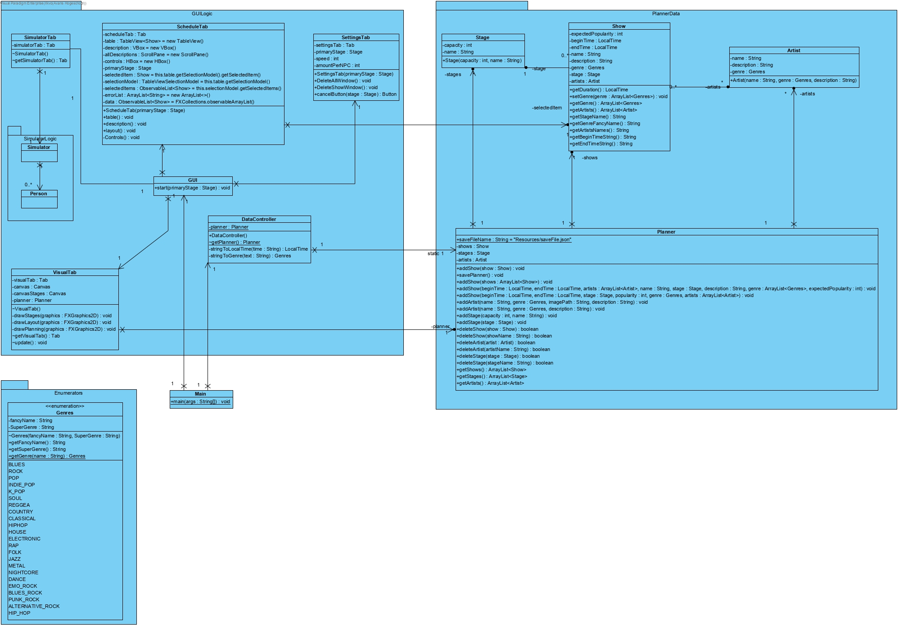
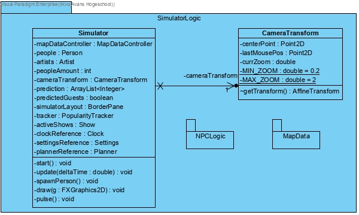
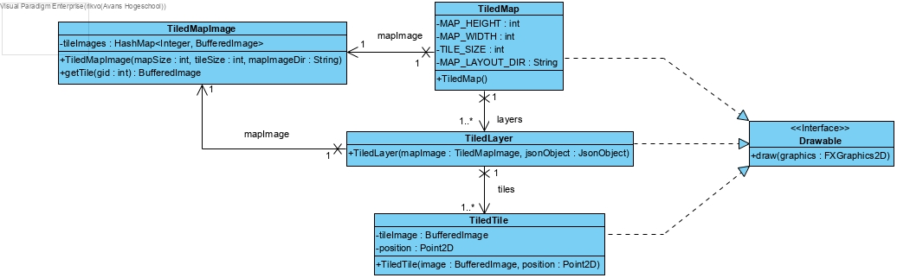

## Reflectie

### week 2

#### samenwerking

we hebben wat problemen ervaren met git, we hebben een code beheerder
die nog niet ervaren was met github en gitkraken dus ging het op het
begin een paar keer fout. De samenwerking deze week verliep redelijk
goed. Iedereen wist wat wie aan het doen was, dit zorgde ervoor dat we
geen miscommunicaties hadden.

#### mijn bijdrage

Deze week heb ik gewerkt aan een stylesheet voor zowel de main pagina
als de popups. Ook heb ik het klassen diagram bijgewerkt en de logica
klassen van de agenda module gemaakt samen met jarne. Als laatste hebben
arne en ik een systeem gemaakt voor het opslaan van de agenda.
Jammergenoeg is het niet gelukt ze op te slaan in json format maar wel
in objectIO format in een .txt bestand.

### week 3

#### samenwerking

Deze week hebben we weer een tutor gesprek gehad. hier kregen we veel
feedback over de vergadering, deze verliep niet soepel. Een van de
fouten was in de notulen bespreken en zorgen dat je aan de hand hiervan
een planning maakt.

#### mijn bijdrage

- klassendiagram bijgewerkt
  
- test cases schrijven   test case StartUp:

| Steps                              | Procedures                           | Expected result                                        |
|:-----------------------------------|:-------------------------------------|:-------------------------------------------------------|
| Start the application              | select the jar file and press launch | opens the schedule tab                                 |
| checks for saved shows             | -                                    | loads all the previously saved shows from the saveFile |
| load the shows in tot the viewPane | -                                    | All the shows are formatted and shown in the pane      |

test case AddShow: dependent on startUp

| Steps               | Procedures                                                                                 | Expected result                                           |
|:--------------------|:-------------------------------------------------------------------------------------------|:----------------------------------------------------------|
| open the add window | Click the Add button                                                                       | a pop-up window occurs                                    |
| Fill in the fields  | fill in the show name, begin time, end time, stage, Genre, expected population and artists | all fields can be filled in                               |
| submit              | Click the submit button                                                                    | the created show is added to the planner and the viewpane |

test case EditShow: dependent on StartUp

| Steps                | Procedures                                  | Expected result                                                            |
|:---------------------|:--------------------------------------------|:---------------------------------------------------------------------------|
| select an show       | click on one of the shows in the viewpane   | the show gets highlighted that is selected                                 |
| open the edit window | Click the Edit button                       | a pop-up window occurs                                                     |
| loading              | -                                           | load the information from the selected show and fill them in in the window |
| edit                 | now you can edit every piece of information | the data in the fields can be modified                                     |
| submit               | click the Submit button                     | the data from the pop-up window is copied on to the show if valid          |
| close window         | -                                           | closes the window after all actions are done                               |

test case RemoveShow: dependent on StartUp

| Steps                  | Procedures                                | Expected result                                                         |
|:-----------------------|:------------------------------------------|:------------------------------------------------------------------------|
| select an show         | click on one of the shows in the viewpane | the show gets highlighted that is selected                              |
| open the remove window | Click the Remove button                   | a pop-up window occurs                                                  |
| loading                | -                                         | load the information from the selected show and show them on the window |
| confirm the deletion   | click the delete button                   | deletes the show from the application                                   |
| close window           | -                                         | closes the window after all actions are done                            |

- table view automatisch data laten laden
- fixed the saving so it saves as an json file format instead of a
  objectIO file
- het laden van de json file

### week 4

#### samenwerking

Deze week hebben we redelijk hard gewerkt. Arne en ik hebben de loader
volledig af gekregen en lars heeft de json opslaan format opniew gemaakt
want de gson die we eerst hadden mocht niet meer. Erwin heeft de agenda
module nog getest en gebuggfixt. Ralf en Kasper hebben een deel van het
laden van de json format van de map geprobeerd te maken maar dit ging te
langzaam dus hadden Arne en ik het snel geprobeerd en dat werkte direct.
dit kwam voornamelijk doordat ik alle opgaves van ogp en 2d graphics af
had waardoor ik precies wist hoe je die subimages moest krijgen. Op de
maandag had ik wel een ergering aan dat Kasper niet serieus meer kon
werken richting het einde van de dag ook na meermaals zeggen van Arne.

#### mijn bijdrage

- klassendiagram voor de map loader gemaaakt
  
- code geschreven met arne om de map te laden en dit werkt volledig
  volgens het klasse diagram

### week 5

#### samenwerking

We hebben na het opstart college even verdeeld wie wat moet doen totdat
we het tutor gesprek hadden.

### week 6

#### samenwerking

Na een zeer stroeve introductie bij de vergadering begonnen we goed te
werken. We hebben durende de dag nog 2 vergaderingen gehouden om
eventuele misverstanden te verkomen en te zorgen dat iedereen zijn taak
goed uitvoert. Op de dinsdag hadden we afgesproken. Hier hebben we heel
hard gewerkt. Dit kwam voornamelijk doordat de tutor ons heeft wakker
geschud.

#### mijn bijdrage

- klassendiagram geupdate
  
- klassendiagram gemaakt voor de disctancemap
  
- veel code rond om het map inladen gemaakt. hierin hebben we meerdere
  lagen laden en meerdere spritesheets laden gemaakt.
- geupdate klassendiagram na de updates rondom het inladen
  

###week 7
####samenwerking 
eerst een vergadering gehad met de projectleider die door gaf wat er besproken was en hoe we verder moeten.

####mijn bijdrage

- sequence diagram voor npc tageting