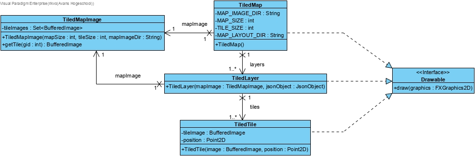

### week 4

#### samenwerking

Deze week hebben we redelijk hard gewerkt. Arne en ik hebben de loader
volledig af gekregen en lars heeft de json opslaan format opniew gemaakt
want de gson die we eerst hadden mocht niet meer. Erwin heeft de agenda
module nog getest en gebuggfixt. Ralf en Kasper hebben een deel van het
laden van de json format van de map geprobeerd te maken maar dit ging te
langzaam dus hadden Arne en ik het snel geprobeerd en dat werkte direct.
dit kwam voornamelijk doordat ik alle opgaves van ogp en 2d graphics af
had waardoor ik precies wist hoe je die subimages moest krijgen. Op de
maandag had ik wel een ergering aan dat Kasper niet serieus meer kon
werken richting het einde van de dag ook na meermaals zeggen van Arne.

#### mijn bijdrage

- klassendiagram voor de map loader gemaaakt
  
- code geschreven met arne om de map te laden en dit werkt volledig
  volgens het klasse diagram