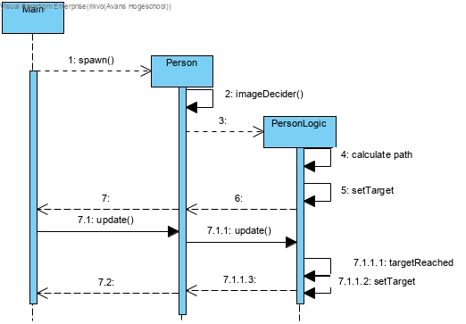
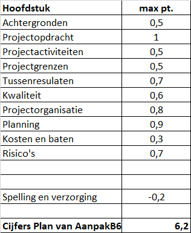

### week 7

#### samenwerking 

Eerst een vergadering gehad met de projectleider die door gaf wat er besproken was en hoe we verder moeten.
Hierna hadden we drie groepen van twee personen.
Erwin en ik zaten samen met het refactoren. 
Hier hebben we de klassen die niet veel meer zouden veranderen verdeeld.
Ik nam de tile klasses voor mijn rekening want deze had ik zelf ook geprogrammeerd dus leek dat me makkelijker.
Er was een verbetering in performance die ik kon vinden en voor de rest overal comments bij gezet.
Toen kwamen we aan bij het senior gesprek.
Dit ging voornamelijk over hoe de camera werkte en hoe we die beter konden maken.
Hier heb ik de feedback over dit verslag te horen gekregen dat het uitgebreider moest zijn met meer keuze omschrijvingen.
Na het gesprek kreeg ik de opdracht om het sequence diagram te maken voor de npc targeting.
Dit was een moeilijk onderdeel want ik snapte van deze structuur niet veel want er was geen klassendiagram van dit deel gemaakt.

#### mijn bijdrage

- sequence diagram voor npc targeting


```
Ik heb het gemodeleerd op wat er gebeurt vanaf creatie, want hieruit kan je de meeste informatie halen.
In de main word de methode spawn(int amount) opgeroepen om zoveel personen aan te maken.
Dan in de constructor van de person klasse word er een genre gekozen en hierna word de personlogic aangemaakt die het genre gebruikt om een doel in te stellen.
Dit doet hij door een stage te zoeken met die genre.
Daarna haalt hij de distancemap op en dan set hij de target voor de person.
Dit target is een blokje weg.
Als hij bij dit blokje aangekomen is ziet de personlogic dat en geeft hij een nieuw target.
```

- pva verbeteren


```
een ondertitel
opdrachtgever enzo klopt niet

resultaat moet alleen het eindresultaat zijn
tussenresultaten geschijden houden

project activiteiten moet je zelf ook dingen verzinnen
letten op de fases van grid
let op werkwoorden (uitbreiden)

planning moet overheen 100% komen met de rest van het PVA

kosten en baten moeten we de opbrengst ook noteren

risico moeten ook maatregelen bij
Stakeholders helemaal fout
```
- comments en refactoring van de map code
- volledige refactor van mijn reflectie