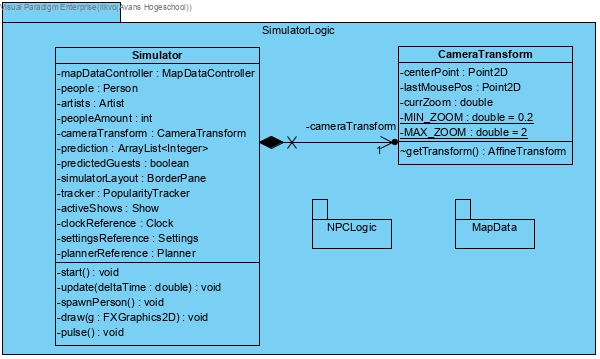

### week 9

#### samenwerking 

Erwin Ralf en Arne hebben verder gewerkt aan de applicatie, buggs gefixt en code opgeschoond.
Ik heb aan de presentatie gewerkt en klassendiagrammen van de applicatie gemaakt.

#### mijn bijdrage

- klassendiagram om de structuur uit te kunnen leggen

- klassdiagram van het laden van de images en json file

- klassendiagram NPCLogic

- klassendiagram SimulatorLogic

- klassendiagram GUILogic simplified

- klassendiagram PlannerData

- invullen van slides

- savefile verbeterd dat de desciptions ook kloppen